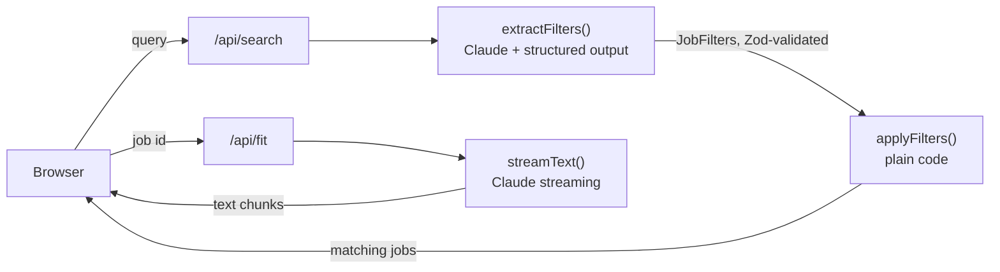

# AI Job Search

[](https://github.com/Tejas94/ai-feature-app/actions/workflows/ci.yml)

Search jobs by typing what you want ("senior React roles in London over 90k"). Claude turns
the sentence into a typed filter object, plain code does the filtering, and every result has
an "Explain my fit" button that streams a comparison with your CV.

**What it proves:** you can ship an AI feature into a product with streaming, structured
output, validation, evals and cost tracking.

> Status: in progress. Project 1 of a 12-week AI engineering plan. See the
> [learning path](docs/LEARNING_PATH.md) for weeks 1-3 and the [roadmap](docs/ROADMAP.md)
> for taking it to production and beyond.

## How it works



The model never filters jobs itself. It only fills in `JobFiltersSchema`
(`src/lib/filters.ts`), and `applyFilters()` does the part that must be exact. Keeping the
LLM out of the exact part is the main design idea, and one you will reuse a lot.

## Run it

```bash
nvm use                      # Node 22 (see .nvmrc)
npm install
cp .env.example .env.local   # add ANTHROPIC_API_KEY
npm run dev                  # http://localhost:3000
npm test                     # all tests; specs in tests/specs stay red until their TODO is done
npm run eval                 # filter extraction against the real model (needs P1-02 and P1-03)
npm run progress             # which TODOs are left
```

Paste a short version of your CV into `data/cv.md`. Replace `data/jobs.json` with real
postings (for example the ones you are applying to) when you polish it.

## Your TODOs

| ID | Week | File | What |
| --- | --- | --- | --- |
| P1-01 | 1 | `src/lib/llm.ts` | Stream text from the raw SDK; read the event types and stop reasons |
| P1-02 | 2 | `src/lib/prompts.ts` | System prompt for query to filters; iterate with evals |
| P1-03 | 2 | `src/lib/extract-filters.ts` | Structured output with Zod, validation, one retry; then compare with prompt-only JSON |
| P1-04 | 3 | `src/lib/prompts.ts` | Prompt for "explain my fit" |
| P1-05 | 3 | `src/lib/cost.ts` | Cost per call; shown in the UI and the eval summary |
| P1-06 | 3 | `evals/cases.ts` | Grow the eval set from 5 to 20+ cases, including tricky ones |

Suggested order: P1-01 in week 1, P1-02 and P1-03 in week 2, then P1-04, P1-05 and P1-06 in
week 3, as in the [learning path](docs/LEARNING_PATH.md).

How the TODOs work:

- Every gap is marked `TODO(P1-nn)` and calls `todo()`, which throws "Not implemented yet:
  P1-05...", so the app and the tests point straight at what is missing.
- A spec in `tests/specs` is red until its TODO is done. Green means done: move the file to
  `tests/core`, and CI guards it from then on.
- Delete the `TODO(P1-nn)` marker when you finish one. `npm run progress` and CI count what
  is left. Each CI run shows the progress table in its summary.

## Map of the code

- `src/lib/filters.ts` the Zod schema the model fills in (its `.describe()` text is prompt too)
- `src/lib/jobs.ts` deterministic filtering, done
- `src/lib/llm.ts`, `extract-filters.ts`, `prompts.ts`, `cost.ts` where your TODOs live
- `src/app/api/search`, `src/app/api/fit` API routes, done
- `src/app/page.tsx` UI with streaming, done
- `evals/` case list, scorer and runner; results are saved as JSON so you can diff runs
- `tests/core` tests for finished code (CI runs these), `tests/specs` specs for open TODOs
- `docs/` learning path, roadmap and experiment log

## Evals and results

Fill this in during week 3, then keep it current. It is the section that separates this
project from the demos recruiters usually see.

| Model | Cases passed | Cost per query | p50 latency |
| --- | --- | --- | --- |
| claude-opus-5-5 | | | |
| claude-sonnet-5-5 | | | |
| claude-haiku-4-5 | | | |

What failed and how it was fixed: [docs/EXPERIMENTS.md](docs/EXPERIMENTS.md).

## Ship it (week 3)

- [ ] Deploy to Vercel (set `ANTHROPIC_API_KEY` there) and add the link here
- [ ] Demo GIF at the top of this README
- [ ] Fill in "Evals and results": pass rate per model, cost per query, what failed and how you fixed it
- [ ] Stretch: rate limiting on the API routes, a Vercel AI SDK version of `/api/fit` to compare

## Working on it with Claude Code

`CLAUDE.md` asks Claude Code to act as a tutor in this repo. It explains, gives hints and
reviews your code, but leaves the TODOs to you unless you ask it to write one.
