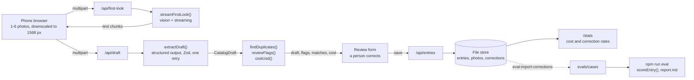

# Product Catalog Builder

[](https://github.com/Tejas94/ai-feature-app/actions/workflows/ci.yml)

Photograph a product from a few angles on your phone, and the app drafts a validated
catalogue entry: category, attributes, condition, description, tags, and the text and
barcodes it can read. A person reviews the flagged fields, fixes what is wrong and saves.

**What it proves:** you can ship a multimodal AI feature with structured output, validation,
code checks on model output, human review, and measured accuracy and cost per entry.

> Status: in progress. Project 1 of a 12-week AI engineering plan. See the
> [learning path](docs/LEARNING_PATH.md) for weeks 1-3 and the [roadmap](docs/ROADMAP.md)
> for taking it to production and beyond.

## How it works



The model does the perception: it reads the labels, judges the wear and writes the copy, and
it fills in one Zod schema (`CatalogDraft` in `src/lib/schema.ts`). Plain code does
everything that must be exact or should not take the model's word for it: duplicate
matching, barcode check digits, confidence caps, scoring and cost. Every save also stores a
field-level diff between the draft and what the person kept. That diff is the live accuracy
signal on `/stats`, and `npm run eval:import-corrections` turns corrected entries into new
eval cases.

## Run it

```bash
nvm use                      # Node 22 (see .nvmrc)
npm install
cp .env.example .env.local   # add ANTHROPIC_API_KEY
npm run dev                  # http://localhost:3000
npm run dev -- -H 0.0.0.0    # the same, reachable from your phone on the same network
npm test                     # all tests; specs in tests/specs stay red until their TODO is done
npm run eval -- --check      # check the eval cases, no API calls
npm run eval                 # extraction against the real model (costs money; needs P1-04)
npm run progress             # which TODOs are left
npm run reset                # back to the seed catalogue (deletes saved entries and photos)
```

The catalogue starts with 12 hand-written entries from `data/catalog.seed.json`. Saved
entries, photos and corrections go to `data/` (gitignored). Set `CATALOG_DATA_DIR` to keep
them somewhere else, such as a mounted volume when you deploy.

## Your TODOs

| ID | Week | File | What |
| --- | --- | --- | --- |
| P1-01 | 1 | `src/lib/llm.ts` | Stream a first look at the photos (vision + streaming) |
| P1-02 | 1 | `src/lib/cost.ts` | Cost per call from usage |
| P1-03 | 2 | `src/lib/prompts.ts` | Extraction system prompt |
| P1-04 | 2 | `src/lib/extract.ts` | Structured extraction with Zod, validation, one retry |
| P1-05 | 2 | `src/lib/duplicates.ts` | Duplicate detection |
| P1-06 | 3 | `src/lib/confidence.ts` | Confidence scoring and review flags |
| P1-07 | 3 | `evals/score.ts` | Field-level accuracy scoring |
| P1-08 | 3 | `evals/cases/README.md` | 20 real products photographed and labelled |

Suggested order: P1-01 and P1-02 in week 1, P1-03, P1-04 and P1-05 in week 2, then P1-06,
P1-07 and P1-08 in week 3, as in the [learning path](docs/LEARNING_PATH.md).

How the TODOs work:

- Every gap is marked `TODO(P1-nn)` and calls `todo()`, which throws "Not implemented yet:
  P1-04...". The app shows that message where the feature would be, the API answers 501,
  and the eval runner prints it per case, so you always know what is missing.
- Optional steps do not block the rest. Before P1-05, P1-06 and P1-02 are done, a draft
  still comes back, with a note saying which checks did not run.
- P1-03 is a placeholder prompt (`TODO(P1-03): write me`), so extraction runs with odd
  output until you write it.
- A spec in `tests/specs` is red until its TODO is done. Green means done: move the file to
  `tests/core`, and CI guards it from then on. P1-01, P1-03, P1-04 and P1-08 are checked by
  hand: in the UI and with `npm run eval`.
- Delete the `TODO(P1-nn)` marker when you finish one. `npm run progress` and CI count what
  is left. Each CI run shows the progress table in its summary.

## Map of the code

- `src/lib/schema.ts` the Zod schema the model fills in. Its `.describe()` text is prompt too.
- `src/lib/taxonomy.ts` the categories, with descriptions you can paste into the prompt
- `src/lib/llm.ts`, `prompts.ts`, `extract.ts`, `cost.ts`, `duplicates.ts`, `confidence.ts`
  where your TODOs live
- `src/lib/images.ts` photo validation, image blocks and the image token estimate, done
- `src/lib/client/downscale.ts` shrinks photos in the browser before upload, done
- `src/lib/store.ts` the file store behind a small `CatalogStore` interface, done
- `src/lib/corrections.ts` the draft versus saved diff and correction rates, done
- `src/app/api/*` the routes: `first-look` (streams NDJSON), `draft`, `entries`, `photos`
- `src/app/new-entry.tsx`, `src/components/review-form.tsx` capture, first look and review
- `src/app/catalog`, `src/app/stats` the catalogue grid, entry pages and stats
- `evals/` cases, the runner, the report and your scorer; `evals/cases/README.md` explains the
  label format
- `tests/core` tests for finished code (CI runs these), `tests/specs` specs for open TODOs
- `docs/` learning path, roadmap and experiment log

## Photos, tokens and privacy

The browser redraws each photo on a canvas at most 1568 px on the long edge and uploads a
JPEG. A photo costs roughly width × height / 750 input tokens, about 2,500 for a 1568 x 1176
photo, so six angles cost more than the whole system prompt. The API would scale a 12 MP
phone photo down anyway, so sending it full size only makes the upload slower and the cost
harder to predict. The page shows the token estimate before you send anything.

Redrawing also drops EXIF data, including GPS location. The server never sees where a photo
was taken. Photos you add to `evals/cases` by hand keep theirs; see
[evals/cases/README.md](evals/cases/README.md).

## Web app now, mobile later

This is a responsive web app on purpose: it works in a phone browser, and
`<input type="file" accept="image/*" capture="environment">` opens the camera directly. The
API is plain JSON and multipart, so a React Native (Expo) camera app on the same routes is
stage 3 of the [roadmap](docs/ROADMAP.md).

## Evals and results

Fill this in during week 3 from `evals/report.md`, then keep it current. It is the section
that separates this project from the demos recruiters usually see.

| Model | Category | Brand | Identifiers | Condition | Tags F1 | Overall | Cost per entry | p50 latency |
| --- | --- | --- | --- | --- | --- | --- | --- | --- |
| claude-opus-5-5 | | | | | | | | |
| claude-sonnet-5-5 | | | | | | | | |
| claude-haiku-4-5 | | | | | | | | |

Eval set: _n_ real products and 4 synthetic ones (see `evals/cases`).

Calibration: fields the model rated 0.7 or higher were right _x_% of the time, against _y_%
below 0.7. After `reviewFlags()`: _x_% against _y_%.

Correction rates from real use (from `/stats`, _n_ saved entries):

| Title | Category | Attributes | Condition | Description | Tags | Identifiers |
| --- | --- | --- | --- | --- | --- | --- |
| | | | | | | |

What failed and how it was fixed: [docs/EXPERIMENTS.md](docs/EXPERIMENTS.md).

## Ship it (week 3)

- [ ] Deploy to a host with a persistent disk (Railway, Render or Fly) with
      `CATALOG_DATA_DIR` on the volume, set `ANTHROPIC_API_KEY` there, and add the link here.
      Vercel's file system does not keep files between requests, so the file store needs
      Postgres and object storage first (stage 2).
- [ ] Rate limiting on `/api/first-look` and `/api/draft`, and a monthly spend limit in the
      Anthropic Console
- [ ] Usage, cost and latency logged for every model call, not only for saved entries
- [ ] A 20-case eval run with `evals/report.md` committed and the table above filled in
- [ ] Demo GIF at the top of this README: photo, first look, flagged field, correction, save
- [ ] The API key only on the server (check the client bundle)

## Working on it with Claude Code

`CLAUDE.md` asks Claude Code to act as a tutor in this repo. It explains, gives hints and
reviews your code, but leaves the TODOs to you unless you ask it to write one.
